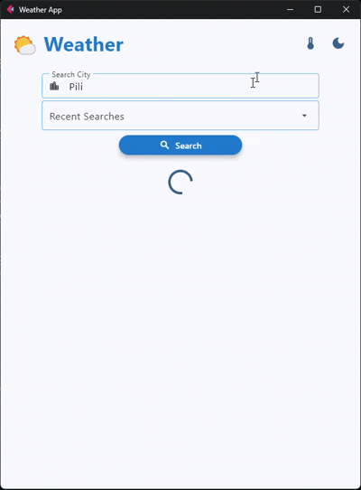
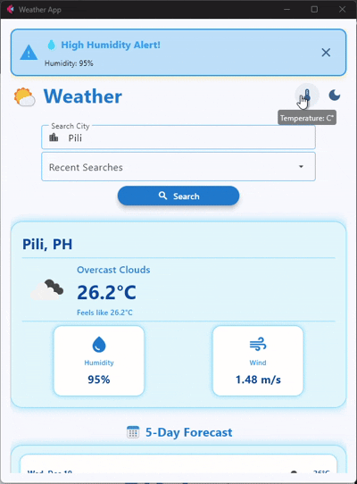
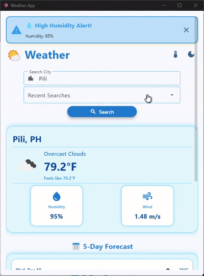
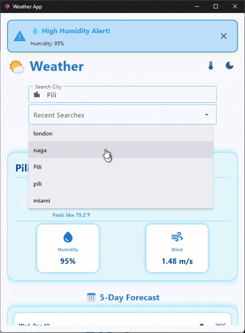

# Weather Application - Module 6 Lab

## Student Information
- **Name**: John Raymond Alba
- **Student ID**: 231002271
- **Course**: CCCS 106
- **Section**: BSCS 3A

## Project Overview
A modern, feature-rich weather application built with Flet 0.28.3 that provides real-time weather data and forecasts. The app integrates with the OpenWeatherMap API to deliver comprehensive weather information with an intuitive user interface. Users can search for cities, view current conditions, access 5-day forecasts, and customize their experience with theme and temperature unit preferences.

## Features Implemented

### Base Features
- [x] City search functionality
- [x] Current weather display
- [x] Temperature, humidity, wind speed
- [x] Weather icons
- [x] Error handling
- [x] Modern UI with Material Design

### Enhanced Features

1. **Search History with Dropdown**
   - Stores the 5 most recent city searches locally in `search_history.json`
   - Quick-access dropdown to reload previous searches without re-typing
   - Automatic persistence across app sessions
   - **Why chosen**: Improves user experience by reducing repetitive typing
   - **Challenges**: Managing state persistence and updating UI when history changes

2. **Dark Mode and Light Mode Toggle**
   - System theme detection with manual toggle button (dark/light mode icon)
   - Respects operating system theme preferences by default
   - Instant theme switching without app restart
   - **Why chosen**: Enhances usability in different lighting conditions and reduces eye strain
   - **Challenges**: Ensuring all UI elements properly adapt to theme changes

3. **Temperature Unit Toggle (Celsius ↔ Fahrenheit)**
   - One-click conversion between temperature units
   - Automatically converts and redisplays all temperatures (current + forecast)
   - User preference saved to `temp_preference.json` for persistence
   - Affects current weather, alerts, and 5-day forecast displays
   - **Why chosen**: Supports international users with different temperature conventions
   - **Challenges**: Managing temperature conversions across multiple data points and alert thresholds

4. **5-Day Weather Forecast**
   - Displays next 5 days of weather predictions
   - Shows daily high/low temperatures, weather conditions, and icons
   - Groups forecast data by day (selects midday entry for consistency)
   - Clean card-based UI with expandable section below current weather
   - Temperature unit conversion integrated with forecast display
   - **Why chosen**: Provides comprehensive weather planning capability
   - **Challenges**: Parsing 3-hour forecast data and grouping by days efficiently

5. **Weather Alerts System**
   - Real-time alerts for extreme weather conditions:
     - High Temperature (>35°C / >95°F)
     - Strong Winds (>15 m/s)
     - Low Humidity (<30%)
     - High Humidity (>80%)
   - Visual banner with color-coded alerts and dismiss button
   - Alerts update automatically when searching for new locations
   - **Why chosen**: Keeps users informed of potentially hazardous conditions
   - **Challenges**: Setting appropriate alert thresholds and displaying them prominently

## Screenshots

### Main Weather Display, Search and Forecast


### Dark Mode & Theme Toggle


### Temperature Unit Conversion & 5-Day Forecast


### Error Handling


## Installation

### Prerequisites
- Python 3.8 or higher
- pip package manager

### Setup Instructions
```bash
# Clone the repository
git clone https://github.com/<username>/cccs106-projects.git
cd cccs106-projects/mod6_labs

# Create virtual environment
python -m venv venv
source venv/bin/activate  # On Windows: venv\Scripts\activate

# Install dependencies
pip install -r requirements.txt

# Create .env file
cp .env.example .env
# Add your OpenWeatherMap API key to .env
